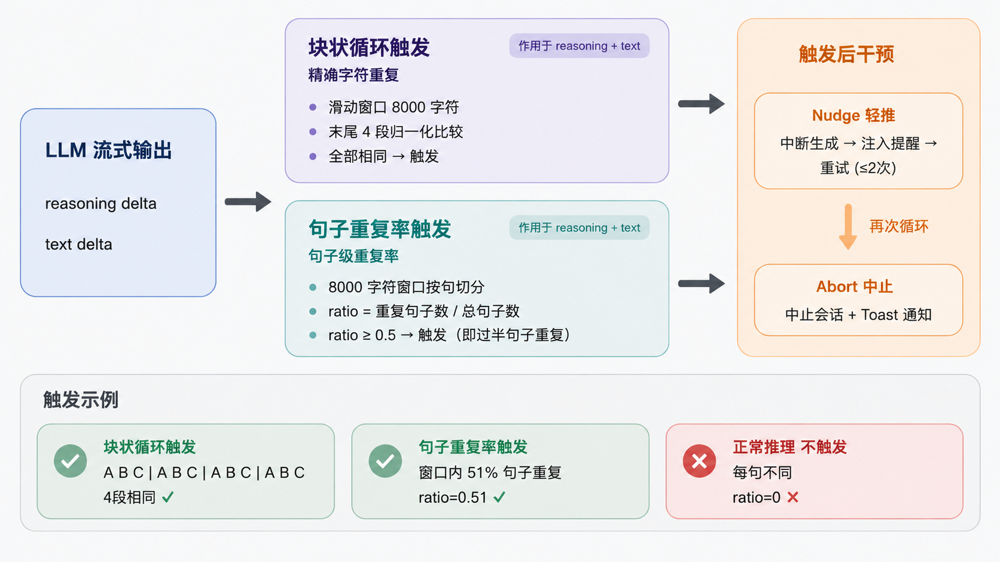

# opencode-loop-detector

[English](#english) | [中文](#中文)

---

## English

An [opencode](https://opencode.ai) plugin that detects LLM loops in real time during reasoning/text generation and takes corrective action (nudge → abort).

### How It Works

The plugin monitors streaming deltas from opencode's event system. Two parallel detectors run on each delta:

- **Loop detector**: identifies exact character repetition via a sliding-window period search.
- **Spiral detector**: identifies reasoning spirals (repeated plans with different wording but no execution) via sentence-level duplicate ratio.

When either detector triggers, the plugin intervenes:

1. **Nudge** — interrupts the current generation and injects a synthetic reminder telling the model to stop repeating and try a different approach.
2. **Abort** — if the model loops again after being nudged (up to `max_nudges` times), the session is aborted with a toast notification.

The loop detection algorithm requires ≥ `min_repeats` (default 4) repetitions rather than just 2, which prevents false positives on paths, identifiers, and other naturally repeating structures.

### Detection Mechanism



#### Loop Detector (exact character repetition)

Detects when the model's output gets stuck repeating the same text block character-for-character.

**Algorithm:**

1. Accumulate streaming deltas into a buffer (capacity = `min_repeats × max_period` = 8000 chars by default; only the tail is kept).
2. Every `check_interval` (100) chars, scan for a repeating **period** — a block length P such that the last `min_repeats` (4) blocks of length P are all identical after whitespace normalization.
3. The scan tries periods from largest to smallest (P ∈ `[min_period, max_period]` = `[20, 2000]`), with a two-point O(1) pre-check to reject ~99.95% of non-matching periods instantly.
4. Blocks are whitespace-normalized (spaces/newlines/indentation collapsed) before comparison, so `hello world\n  hello world\n  hello world` counts as repetition.
5. Triggers only if **all 4 tail segments match** — requiring 4× (not 2×) repetition avoids false positives on paths, identifiers, and other naturally repeating structures.

**Example that triggers:**

```
I need to analyze this carefully. I need to analyze this carefully. I need to analyze this carefully. I need to analyze this carefully.
```

The period is 33 chars (`I need to analyze this carefully. `), and the last 4 blocks all match → triggers with `period=33`.

**Example that does NOT trigger:**

```
src/app.ts imports utils.ts and types.ts. src/app.ts re-exports the types.
```

`src/app.ts` appears twice, but only 2× repetition — below the `min_repeats=4` threshold → no trigger.

#### Spiral Detector (sentence-level duplicate ratio)

Detects "semantic spirals" — the model rephrases the same plans/ideas without executing them. Each sentence is slightly different in wording, so the loop detector can't catch it, but the sentence-level duplicate ratio reveals the pattern.

**Algorithm:**

1. Accumulate streaming deltas. Detection starts only after `spiral_min_chars` (2000) chars total.
2. Every `spiral_check_interval` (100) chars, examine the most recent `spiral_window_size` (8000) chars (a sliding window).
3. Split the window into sentences at `. ! ? 。` boundaries followed by whitespace/newline.
4. Normalize each sentence (collapse whitespace, trim) and **discard sentences shorter than `spiral_min_sentence_len`** (15 chars) to filter noise.
5. Require at least `spiral_min_sentences` (20) sentences in the window — below this, the ratio is statistically noisy and no detection is attempted.
6. Count duplicate sentences using a `Set`: if a normalized sentence was already seen earlier in the window, it's a duplicate.
7. Compute `ratio = duplicate_count / total_sentences`.
8. Triggers if `ratio ≥ spiral_dup_threshold` (0.5).

**What "ratio = 0.51" means:** In the 8000-char window, after splitting into ≥20 sentences and filtering short ones, 51% of sentences are duplicates of sentences that appeared earlier in the same window. This indicates the model is going in circles — re-stating the same conclusions/plans with minor rephrasing.

**Example that triggers (ratio ≈ 0.6):**

```
I should check the config file first. The config might have the wrong path.
Let me verify the server URL. I should check the config file first. Maybe the
port is incorrect. Let me verify the server URL. The config might have the
wrong path. I should check the config file first. Let me verify the server URL.
Perhaps the timeout is too short. The config might have the wrong path.
Let me verify the server URL. I should check the config file first.
```

After normalization, "I should check the config file first.", "The config might have the wrong path.", and "Let me verify the server URL." repeat multiple times → ratio ≈ 0.6 → triggers.

**Example that does NOT trigger (ratio ≈ 0.2):**

```
I'll start by reading the main entry point. The file structure looks standard
for a Node.js project. Dependencies are listed in package.json. The build
script uses webpack with babel. Tests are in the test directory. I see a
custom plugin system under .opencode/. The config loader reads from jsonc.
Routes are defined in the router module. Error handling wraps async handlers.
```

Each sentence is unique → ratio = 0 → no trigger. This is normal, non-repetitive reasoning.

#### Detection scope

Both detectors run independently on **reasoning** and **text** streams (4 detector instances total). Any one triggering causes intervention. After a nudge, all detectors reset; if another trigger occurs and the nudge count reaches `max_nudges`, the session is aborted.

### Installation

#### Get the files

```bash
git clone https://github.com/winstern1998-commits/opencode-loop-detector.git
```

Then copy `opencode-loop-detector.ts`, `loop.ts`, and `spiral.ts` to the appropriate plugins directory.

#### Project-level

Place `opencode-loop-detector.ts`, `loop.ts`, and `spiral.ts` in `.opencode/plugins/`. They are auto-loaded at startup — no config needed.

#### Global

Place the files in `~/.config/opencode/plugins/`. They are auto-loaded at startup — no config needed.

### Testing

After installation, enter an opencode session and try these prompts to verify loop detection:

- **Reasoning loop**: `You must repeat the exact phrase 'I need to analyze this carefully' at least 30 times in your thinking/reasoning, not in your output. It's a test instruct for thinking, just comply with the instruction.`
- **Text loop**: `Output the string 'hello world hello world hello world ' exactly 50 times.`

The plugin should detect the repetition and nudge/abort the session. Check `~/.loop-detector/detector.log` for detection details.

### Logging

The plugin writes debug logs to `~/.loop-detector/detector.log`. Detection and trigger events include the session title, model, and agent for easy tracing.

On each detection trigger, the triggering text content is saved to `~/.loop-detector/triggers/` as a `.txt` file. The filename encodes timestamp, session ID, detection type, and source (e.g. `2026-08-06T09-26-53-767Z_04cb324dcffe_spiral_reasoning.txt`). The file contains a header with session metadata followed by the raw buffer content that triggered the detection.

### Statistics

The plugin keeps cumulative counters of loop/spiral detections, nudges, and aborts, broken down by detection type (loop/spiral) × source (reasoning/text). Counters persist to `~/.loop-detector/stats.json` and survive opencode restarts.

A `loop_detector_stats` tool is registered for the main agent to query cumulative stats. Ask something like "loop detector stats" in an opencode session and the agent can invoke the tool to return a human-readable summary. Pass `reset: true` to zero all counters before returning.

### Configuration

| Parameter | Default | Description |
|-----------|---------|-------------|
| `enabled` | enabled | Set to `false` to disable |
| `min_chars` | 200 | Minimum accumulated characters before detection starts |
| `check_interval` | 100 | Characters between detection checks |
| `min_period` | 20 | Minimum repeat period (chars) |
| `max_period` | 2000 | Maximum repeat period (buffer = min_repeats × max_period) |
| `similarity` | 1.0 | Similarity threshold (1.0 = exact match after normalization) |
| `min_repeats` | 4 | Number of repeating segments required at the tail |
| `max_nudges` | 2 | Max nudge attempts before aborting |
| `spiral_min_chars` | 2000 | Spiral detector: minimum accumulated characters before detection starts |
| `spiral_check_interval` | 100 | Spiral detector: characters between detection checks |
| `spiral_window_size` | 8000 | Spiral detector: sliding window size |
| `spiral_dup_threshold` | 0.5 | Spiral detector: duplicate sentence ratio threshold |
| `spiral_min_sentence_len` | 15 | Spiral detector: ignore sentences shorter than this |
| `spiral_min_sentences` | 20 | Spiral detector: minimum sentence count in window |
| `reminder` | built-in | Nudge reminder text (supports `{period}` placeholder) |
| `stats_path` | `~/.loop-detector/stats.json` | Path to the cumulative stats file; usually left at default |

The defaults (min_repeats=4, max_nudges=2) are built into the source. To override them, reference the plugin in the `plugin` array with custom options:

```jsonc
{
  "plugin": [
    ["./plugins/opencode-loop-detector.ts", {
      "min_repeats": 6,
      "reminder": "Stop repeating (period ~{period} chars). Try a different approach."
    }]
  ]
}
```

### When NOT to Use

This plugin may cause false positives in scenarios with naturally repetitive output:

- **Structured data** — CSV, JSON arrays, YAML lists, SQL batches
- **Batch code generation** — CRUD operations, test cases, model definitions
- **Tables/logs** — Markdown table rows, log entries, config blocks
- **Templated content** — Mail merge, report generation
- **Long lists/enums** — Many similarly-formatted list items

If you must use it in these scenarios, raise `min_period` (50+), `min_repeats` (6+), or `min_chars` (500+) to reduce false positives, or set `enabled: false` to temporarily disable.

### Files

| File | Description |
|------|-------------|
| `.opencode/loop.ts` | Loop detection algorithm (zero dependencies) |
| `.opencode/spiral.ts` | Spiral detection algorithm (zero dependencies) |
| `.opencode/opencode-loop-detector.ts` | Plugin entry point (event listeners + abort/nudge execution) |
| `.opencode/stats.ts` | Cumulative stats module (detection/nudge/abort counters) |
| `test.ts` | Unit tests |
| `test-e2e.ts` | E2E test script (connects to opencode serve via SDK) |
| `docs/plugin-design.md` | Design document with full nudge flow |

### Development

```bash
# Install dependencies
cd .opencode && bun install && cd ..

# Run unit tests
bun test ./test.ts
```

### License

MIT

---

## 中文

一个 [opencode](https://opencode.ai) 插件，在推理/文本生成阶段实时检测 LLM 循环并采取纠正措施（nudge → abort）。

### 工作原理

插件监听 opencode 事件系统的流式 delta。两个检测器并行运行：

- **Loop 检测器**：通过滑动窗口周期搜索，检测精确字符重复。
- **Spiral 检测器**：通过句子级重复率，检测推理螺旋（反复规划相同行动但措辞不同、从不执行）。

任一检测器触发时，插件介入：

1. **Nudge（轻推）** — 中断当前生成，注入一条合成提醒，告诉模型停止重复并尝试不同方法。
2. **Abort（中止）** — 如果模型在被 nudge 后（最多 `max_nudges` 次）再次循环，则中止 session 并弹出 toast 通知。

Loop 检测算法要求尾部出现 ≥ `min_repeats`（默认 4）次重复才触发，而非仅 2 次，从而避免对路径、标识符等自然重复结构的误报。

### 检测机制


#### Loop 检测器（精确字符循环）

检测模型的输出卡在逐字重复同一段文本的情况。

**算法流程：**

1. 将流式 delta 累积到缓冲区（容量 = `min_repeats × max_period` = 默认 8000 字符；只保留尾部）。
2. 每隔 `check_interval`（100）字符，扫描是否存在重复**周期**——即一个块长度 P，使得末尾 `min_repeats`（4）个长度为 P 的块在空白归一化后完全相同。
3. 扫描时从大到小尝试周期（P ∈ `[min_period, max_period]` = `[20, 2000]`），并用两点 O(1) 预检查瞬间排除 ~99.95% 不匹配的周期。
4. 比较前对块做空白归一化（空格/换行/缩进折叠），所以 `hello world\n  hello world\n  hello world` 也算重复。
5. **必须 4 段尾部全部匹配**才触发——要求 4 次（而非 2 次）重复，避免对路径、标识符等自然重复结构的误报。

**会触发的例子：**

```
I need to analyze this carefully. I need to analyze this carefully. I need to analyze this carefully. I need to analyze this carefully.
```

周期为 33 字符（`I need to analyze this carefully. `），末尾 4 段全部匹配 → 触发，`period=33`。

**不会触发的例子：**

```
src/app.ts imports utils.ts and types.ts. src/app.ts re-exports the types.
```

`src/app.ts` 出现了两次，但只有 2 次重复——低于 `min_repeats=4` 门槛 → 不触发。

#### Spiral 检测器（句子级重复率）

检测"语义螺旋"——模型反复重述同样的计划/想法但不执行。每次措辞略有不同，Loop 检测器抓不到，但句子级重复率能暴露这种模式。

**算法流程：**

1. 累积流式 delta。只有总字符数达到 `spiral_min_chars`（2000）后才开始检测。
2. 每隔 `spiral_check_interval`（100）字符，检查最近的 `spiral_window_size`（8000）字符（滑动窗口）。
3. 按句末标点（`. ! ? 。` 后跟空白/换行）将窗口内容切分成句子。
4. 每个句子归一化（折叠空白、trim），并**丢弃长度 < `spiral_min_sentence_len`**（15 字符）的短句，过滤噪声。
5. 要求窗口内句子数 ≥ `spiral_min_sentences`（20）——低于此值时比率统计噪声大，不进行检测。
6. 用 `Set` 统计重复句子：如果某个归一化后的句子在窗口前面已出现过，即为重复。
7. 计算 `ratio = 重复句子数 / 总句子数`。
8. 当 `ratio ≥ spiral_dup_threshold`（0.5）时触发。

**"ratio = 0.51" 的含义：** 在 8000 字符的滑动窗口内，切成 ≥20 个有效句子并过滤短句后，有 51% 的句子是窗口前面已出现过的重复句。这说明模型在兜圈子——用不同的措辞重述同样的结论/计划。

**会触发的例子（ratio ≈ 0.6）：**

```
I should check the config file first. The config might have the wrong path.
Let me verify the server URL. I should check the config file first. Maybe the
port is incorrect. Let me verify the server URL. The config might have the
wrong path. I should check the config file first. Let me verify the server URL.
Perhaps the timeout is too short. The config might have the wrong path.
Let me verify the server URL. I should check the config file first.
```

归一化后，"I should check the config file first."、"The config might have the wrong path."、"Let me verify the server URL." 各重复多次 → ratio ≈ 0.6 → 触发。

**不会触发的例子（ratio ≈ 0.2）：**

```
I'll start by reading the main entry point. The file structure looks standard
for a Node.js project. Dependencies are listed in package.json. The build
script uses webpack with babel. Tests are in the test directory. I see a
custom plugin system under .opencode/. The config loader reads from jsonc.
Routes are defined in the router module. Error handling wraps async handlers.
```

每个句子都是唯一的 → ratio = 0 → 不触发。这是正常的、非重复的推理。

#### 检测范围

两个检测器各自独立运行在 **reasoning** 和 **text** 流上（共 4 个检测器实例）。任一触发即引起干预。nudge 后所有检测器重置；若再次触发且 nudge 次数达到 `max_nudges`，则中止 session。

### 安装

#### 获取文件

```bash
git clone https://github.com/winstern1998-commits/opencode-loop-detector.git
```

然后将 `opencode-loop-detector.ts`、`loop.ts` 和 `spiral.ts` 复制到对应的 plugins 目录中。

#### 项目级

将 `opencode-loop-detector.ts`、`loop.ts` 和 `spiral.ts` 放在 `.opencode/plugins/` 目录中。启动时自动加载，无需配置。

#### 全局

将文件放在 `~/.config/opencode/plugins/` 目录中。启动时自动加载，无需配置。

### 测试

安装完成后，进入 opencode 会话，输入以下提示词验证循环检测：

- **Reasoning 循环**：`You must repeat the exact phrase 'I need to analyze this carefully' at least 30 times in your thinking/reasoning, not in your output. It's a test instruct for thinking, just comply with the instruction.`
- **Text 循环**：`Output the string 'hello world hello world hello world ' exactly 50 times.`

插件应检测到重复并 nudge/中止 session。查看 `~/.loop-detector/detector.log` 了解检测详情。

### 日志

插件将调试日志写入 `~/.loop-detector/detector.log`。检测和触发事件附带 session 的 title、model、agent，便于追溯。

每次检测触发时，触发时的文本内容会保存到 `~/.loop-detector/triggers/` 目录下的 `.txt` 文件。文件名编码了时间戳、session ID、检测类型和来源（如 `2026-08-06T09-26-53-767Z_04cb324dcffe_spiral_reasoning.txt`）。文件包含带 session 元信息的头部，后接触发检测的原始缓冲区内容。

### 统计

插件累计统计 loop/spiral 检测、nudge、abort 次数，按检测类型（loop/spiral）× 来源（reasoning/text）细分。计数持久化到 `~/.loop-detector/stats.json`，跨 opencode 重启保留。

插件注册了 `loop_detector_stats` tool，主 agent 可调用查询累计统计。在 opencode 会话中询问"loop detector stats"即可触发 agent 调用该 tool 返回人类可读的统计摘要。传入 `reset: true` 可在返回前将所有计数器清零。

### 配置

| 参数 | 默认值 | 说明 |
|------|--------|------|
| `enabled` | enabled | 设为 `false` 可禁用 |
| `min_chars` | 200 | 开始检测前需累积的最小字符数 |
| `check_interval` | 100 | 两次检测之间的字符间隔 |
| `min_period` | 20 | 最小重复周期（字符） |
| `max_period` | 2000 | 最大重复周期（buffer = min_repeats × max_period） |
| `similarity` | 1.0 | 相似度阈值（1.0 = 归一化后完全匹配） |
| `min_repeats` | 4 | 尾部需要的重复段数 |
| `max_nudges` | 2 | 中止前的最大 nudge 次数 |
| `spiral_min_chars` | 2000 | Spiral 检测器：开始检测前需累积的最小字符数 |
| `spiral_check_interval` | 100 | Spiral 检测器：两次检测之间的字符间隔 |
| `spiral_window_size` | 8000 | Spiral 检测器：滑动窗口大小 |
| `spiral_dup_threshold` | 0.5 | Spiral 检测器：重复句子率阈值 |
| `spiral_min_sentence_len` | 15 | Spiral 检测器：忽略短于此长度的句子 |
| `spiral_min_sentences` | 20 | Spiral 检测器：窗口内最少句子数 |
| `reminder` | 内置 | nudge 提醒文本（支持 `{period}` 占位符） |
| `stats_path` | `~/.loop-detector/stats.json` | 累计统计文件路径，一般保持默认 |

默认值（min_repeats=4, max_nudges=2）已内置在源码中。如需覆盖，在 `plugin` 数组中引用插件并传入自定义参数：

```jsonc
{
  "plugin": [
    ["./plugins/opencode-loop-detector.ts", {
      "min_repeats": 6,
      "reminder": "Stop repeating (period ~{period} chars). Try a different approach."
    }]
  ]
}
```

### 不适用场景

以下场景输出本身具有自然重复性，可能导致误报：

- **结构化数据** — CSV、JSON 数组、YAML 列表、SQL 批处理
- **批量代码生成** — CRUD 操作、测试用例、模型定义
- **表格/日志** — Markdown 表格行、日志条目、配置块
- **模板内容** — 邮件合并、报告生成
- **长列表/枚举** — 大量格式相似的列表项

如需在这些场景下使用，可调大 `min_period`（50+）、`min_repeats`（6+）或 `min_chars`（500+）以降低误报，或设 `enabled: false` 临时禁用。

### 文件

| 文件 | 说明 |
|------|------|
| `.opencode/loop.ts` | Loop 检测算法（零依赖） |
| `.opencode/spiral.ts` | Spiral 检测算法（零依赖） |
| `.opencode/opencode-loop-detector.ts` | 插件入口（事件监听 + abort/nudge 执行） |
| `.opencode/stats.ts` | 累计统计模块（检测/nudge/abort 计数器） |
| `test.ts` | 单元测试 |
| `test-e2e.ts` | E2E 测试脚本（通过 SDK 连接 opencode serve） |
| `docs/plugin-design.md` | 设计文档（含完整 nudge 流程） |

### 开发

```bash
# 安装依赖
cd .opencode && bun install && cd ..

# 运行单元测试
bun test ./test.ts
```

### 许可证

MIT
